# Lab9Web
## Andre Mahadi
## 312110221
## TI.21.B1
<br>
<b>XAMPP</b>

Buka XAMPP Control Lalu Klik `Start` untuk menjalankan MySQL Server. Pastikan web server Apache dan MySQL Server sudah dijalankan.
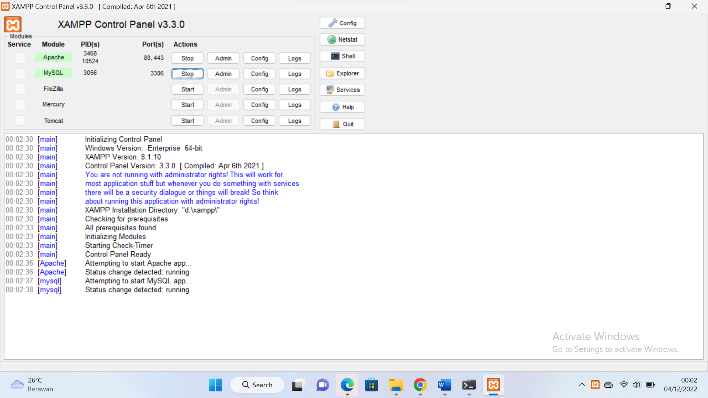<br>

Membuat Folder `lab9_php_modular` pada root directory web server (d:\xampp\htdocs)
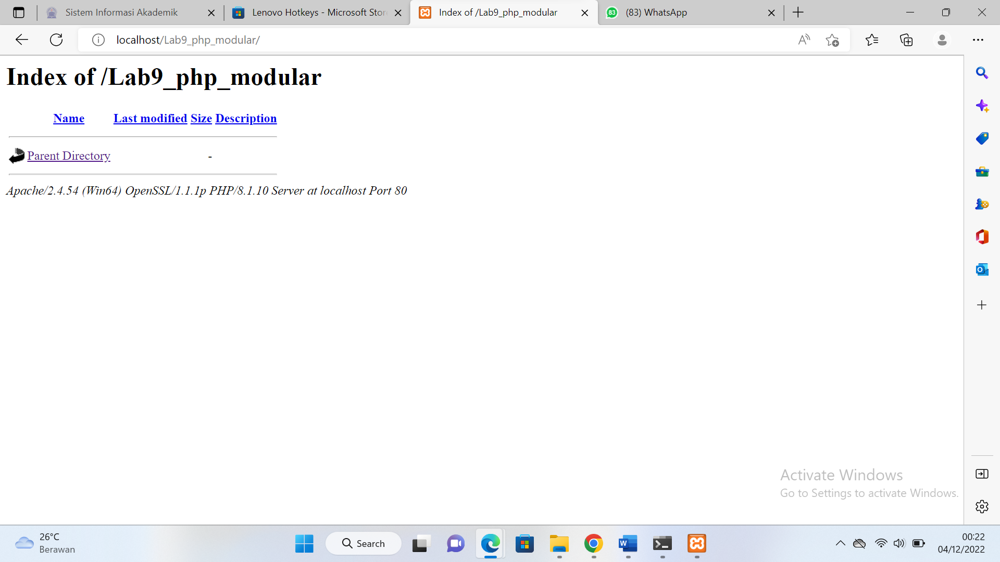<br>

Setelah itu uji coba gunakan URL :
```
http://localhost/lab9_php_modular/
```
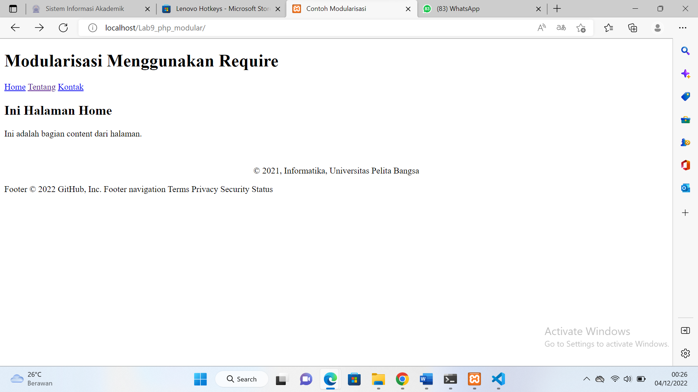<br>

<b>Praktikum</b>

<b>Hasil pratikum
<br>

<b>Tugas</b>

Membuat file baru dengan nama `header.php`
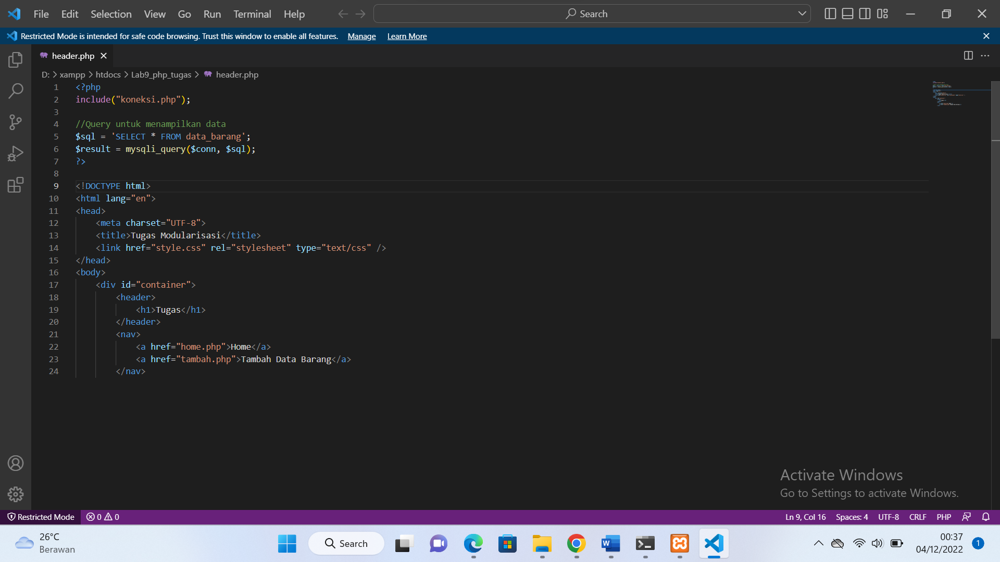<br>

Membuat file baru dengan nama `footer.php`
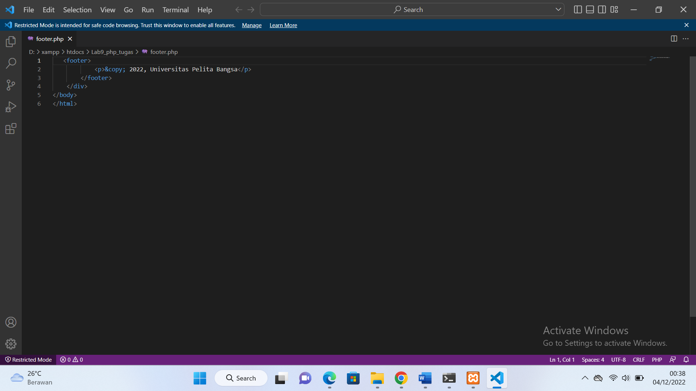<br>

Membuat file baru dengan nama `home.php`
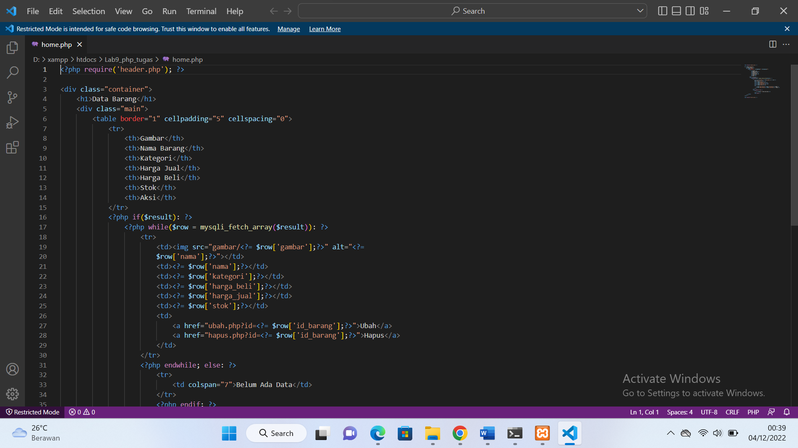<br>

Membuat file baru dengan nama `tambah.php`
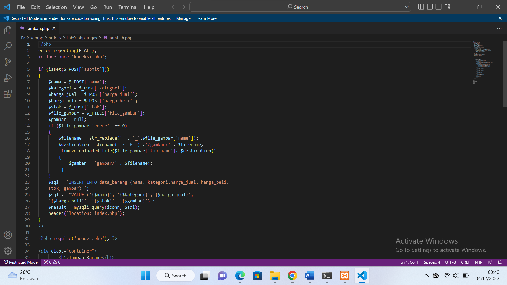<br>

Membuat file baru dengan nama `ubah.php`
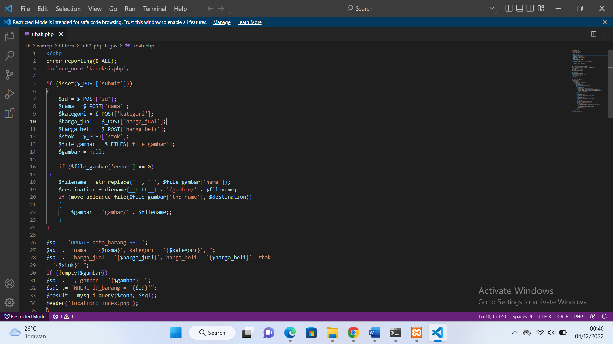<br>

Membuat file baru dengan nama `hapus.php`
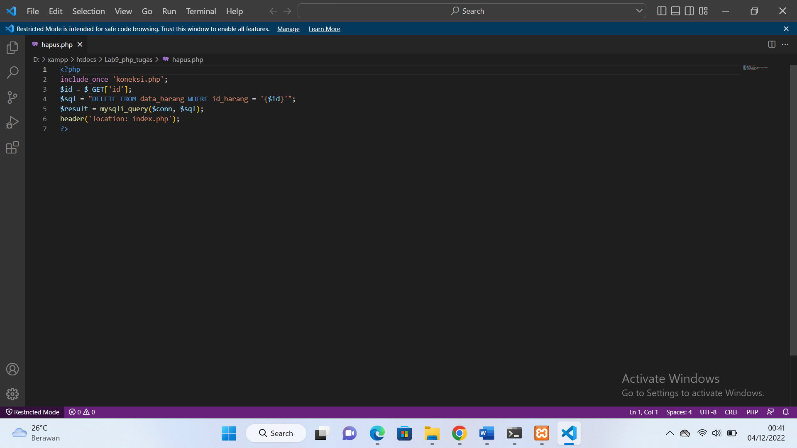<br>

Membuat file baru dengan nama `style.css`
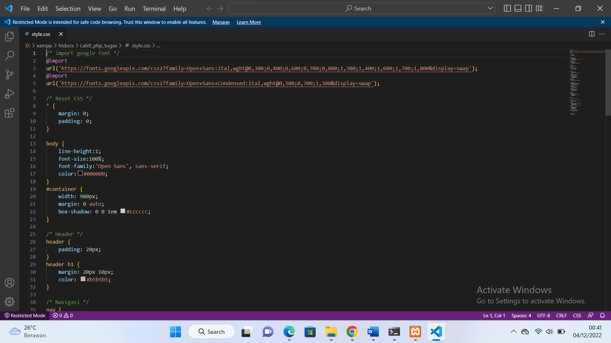<br>

Hasilnya :<br>
Tampilan Home
<br>

Tampilan Tambah Data Barang
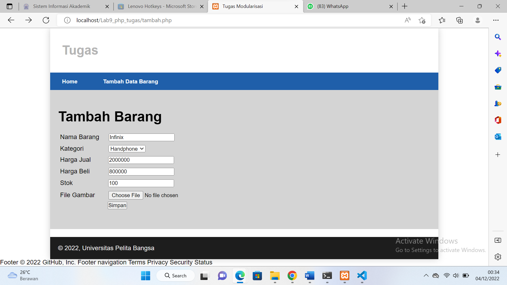<br>

